### 🏗️ Architecture Technique

The application is built on a decoupled architecture separating the client interface from the inference logic.

  

### 🛠️ Tech Stack & Flow

| Component     | Technology      | Role                                                          |
| :---          | :---            | :---                                                          |
| **Frontend**  | **Next.js**     | Handles UI rendering and manages the chat state.             |
| **Backend**   | **FastAPI**     | Orchestrates the RAG logic and handles API endpoints.        |
| **Vector DB** | **Pinecone**    | Stores document embeddings for semantic search retrieval.    |
| **LLM**       | **Azure OpenAI**| Provides Embedding models (Ada-002) and Chat models (GPT-3.5/4). |

```mermaid
flowchart LR
    %% Styles
    classDef user fill:#f9f,stroke:#333,stroke-width:2px;
    classDef front fill:#e1f5fe,stroke:#0277bd,stroke-width:2px;
    classDef back fill:#e8f5e9,stroke:#2e7d32,stroke-width:2px;
    classDef ai fill:#fff3e0,stroke:#ef6c00,stroke-width:2px;
    classDef db fill:#f3e5f5,stroke:#7b1fa2,stroke-width:2px;

    %% Nodes
    User((Utilisateur)):::user
    UI[Frontend\nNext.js]:::front
    API[Backend\nFastAPI]:::back

    subgraph External_Services ["☁️ Cloud & AI Services"]
        direction TB
        OAI[[Azure OpenAI]]:::ai
        PC[(Pinecone\nVector DB)]:::db
    end

    %% Flow
    User -->|Question| UI
    UI -->|API Request| API
    
    %% RAG Steps
    API -->|1. Embed Query| OAI
    API -->|2. Semantic Search| PC
    PC -.->|3. Context Chunks| API
    API -->|4. Context + Prompt| OAI
    OAI -.->|5. Generated Answer| API
    
    %% Return
    API -.->|Streamed Response| UI
```

